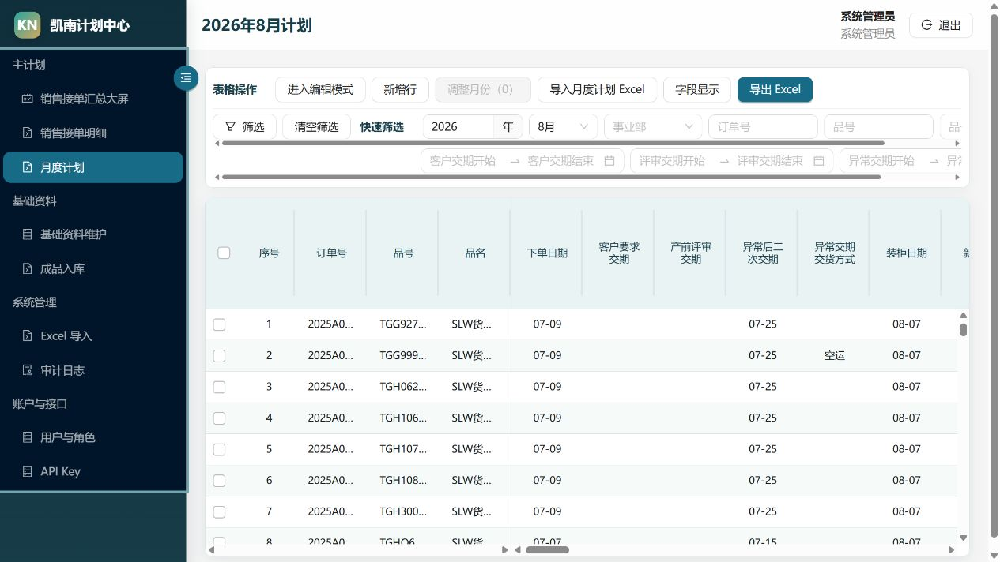
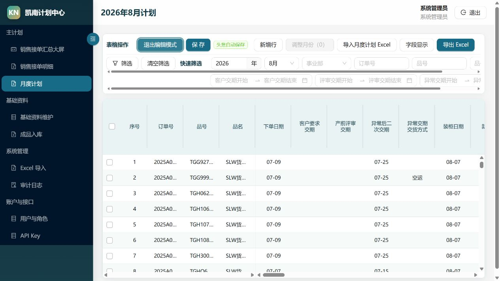
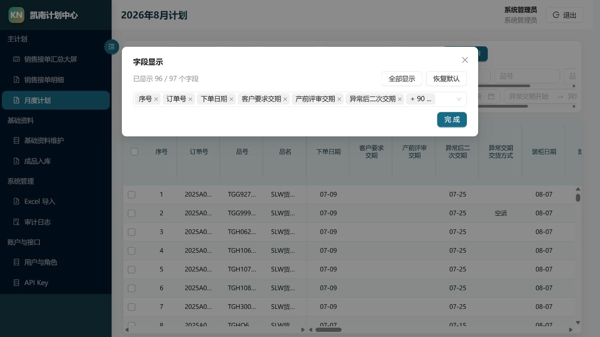

# 月度计划填写说明（精简版）

> 适用页面：凯南数字化工作台 → Planning Center → 月度计划
> 原则：只维护自己负责的数据；一个单元格只对应一条记录；不确定的字典值先联系管理员维护基础资料。

## 一、1 分钟上手

1. 登录系统，在左侧选择 **月度计划**。
2. 先确认正确的 **年月、版本号和版本状态**。只有 `DRAFT` 可以编辑，`PUBLISHED`/`LOCKED` 只能查看。
3. 在草稿版本点击 **进入编辑模式**。
4. 点击要修改的单元格：日期用日期选择器，字典字段用下拉框，数量字段只填数字。
5. 离开单元格时系统会自动保存；全部填写完成后点击 **保存**，系统保存成功后会退出编辑模式。

> **重要：**不要连续快速修改同一个单元格。看到“失焦自动保存”时，改完一格后点击下一格即可；如果提示保存失败，请保留当前页面并联系管理员，不要重复导入。

## 二、编辑、筛选和字段显示

### 编辑

- **进入编辑模式**：开启单元格编辑。
- **失焦自动保存**：点击其他单元格后，刚才的内容会自动保存。
- **保存**：保存当前修改并退出编辑模式。
- **退出编辑模式**：放弃尚未提交的界面编辑状态。
- **新增计划行**：在当前 Draft 新增一条计划记录；系统只允许维护可编辑字段。
- **批量修改**：选择多行后批量设置优先级、责任组织、负责人、交期或计划状态。
- **移到顶部／上移／下移／移到底部**：调整并保存计划顺序。
- 月度计划不允许手工删除。

### 筛选与字段显示

- **快速筛选**：按订单号、品号和品号状态查找；表头支持排序。
- **字段显示**：只保留本岗位常用列；设置会按用户保存。`关联信息`默认隐藏。
- 表头中的工序组可以收起或展开，横向查看时优先收起暂时不需要的工序组。

## 三、字段填写说明

### 1. 系统字段（不要填写）

| 字段 | 说明 |
| --- | --- |
| 序号 | 系统生成的显示顺序。 |
| 订单号、品号、品名、下单日期 | 来自订单或导入数据，月度计划中不可直接修改。 |
| 关联信息 | 由订单号和品号组合生成，用于唯一关联数据；默认隐藏。 |
| 订单欠数 | 系统根据订单需求数量和入库数量计算。 |
| 品号状态 | 系统根据关键工序和入库完成情况计算。 |
| 毛坯／烤漆·电镀／组装·包装的“状态” | 系统根据该工序数量、订单需求数量和交期计算。 |
| 年月 | 由当前月度计划决定，不在单元格内修改。 |
| 订单入库金额、订单欠数金额 | 系统根据数量和单价计算。 |

### 2. 订单与交期信息

| 字段 | 怎么填 |
| --- | --- |
| 客户要求交期 | 客户最初确认的交付日期。 |
| 产前评审交期 | 内部评审后确定的生产交期。 |
| 异常后二次交期 | 原交期发生异常后重新确认的交期；没有二次交期时留空。 |
| 异常交期交货方式 | 从下拉框选择空运、海运、汽运、火车、内河船运或其他。 |
| 装柜日期 | 计划或实际装柜日期，以当前业务口径填写。 |
| 新旧款 | 下拉选择“新”或“旧”。 |
| 简图 | 上传或查看产品简图。 |
| 产品属性 | 下拉选择五金、木作或五金+木作。 |
| 表面性质 | 下拉选择烤漆或电镀；不适用时留空。 |
| 特别项 | 当前用于标记亚克力等特殊项；按下拉选项填写。 |
| 订单需求数量 | 本品号在该订单中的计划生产数量，可填整数或小数。 |
| 历史入库数据 | 截至当天以前的累计入库数量。 |
| 当天入库数 | 当天新增的入库数量。 |
| 制作方式 | 下拉选择自制、中心外购、外协或自制+外协。 |

### 3. 外协相关

| 字段 | 怎么填 |
| --- | --- |
| 外协方式 | 下拉选择成品、毛坯或部件。 |
| 外协供应商 | 从供应商下拉框选择；没有对应供应商时先到基础资料维护供应商。 |
| 外协交期 | 与供应商约定的交付日期。 |
| 外协实际交期 | 供应商实际完成或交付日期。 |

> 制作方式不含外协时，外协相关字段通常留空；选择外协或自制+外协时，应尽量补全外协方式、供应商和交期。

### 4. 工序字段

月度计划包含以下工序：

- 图纸&BOM、五金主材、木作主材；
- **毛坯组**：前道配件、机加、焊接/点焊、研磨、毛坯；
- **烤漆/电镀组**：木作、油漆、亚克力、烤漆/电镀；
- **组装&包装组**：后道包材&配件、组装&包装。

各工序按相同口径填写：

| 子字段 | 怎么填 |
| --- | --- |
| 所需天数 | 预计完成本工序需要的天数，可填整数或小数。 |
| 交期 | 本工序必须完成的日期，不是整张订单的总交期。 |
| 状态／状态·数量 | 记录当前进度；图纸&BOM等列按现行业务口径填写完成标记或数量。关键工序的“状态”由系统自动计算。 |
| 数量 | 仅毛坯、烤漆/电镀、组装&包装使用，填写累计完成数量，可填小数。 |
| 异常 | 填写异常原因、影响和处理结果，建议使用“原因；影响；措施”的短句。 |

关键工序状态规则：

| 状态 | 系统判断规则 |
| --- | --- |
| 已完成 | 工序数量 ≥ 订单需求数量。 |
| 进行中 | 今天早于工序交期，且工序数量 < 订单需求数量。 |
| 即将延期 | 今天等于工序交期，且工序数量 < 订单需求数量。 |
| 延期 | 今天晚于工序交期，且工序数量 < 订单需求数量。 |

`品号状态`取三个关键工序中的最高预警等级；当历史入库数据 + 当天入库数 ≥ 订单需求数量时显示“完成”，其他情况显示“进行中”。

### 5. 结果与辅助信息

| 字段 | 怎么填 |
| --- | --- |
| 对应计划页数 | 对应纸质或其他计划文件的页码，没有时留空。 |
| 订单异常信息 | 填写订单层面的异常，避免重复写普通工序进度。 |
| 验货 | 填写验货状态、结论或日期，按部门现行口径填写。 |
| 验货数量 | 已验货数量，只填数字。 |
| 备注 | 填写其他必须说明、但没有专用字段的信息。 |
| 订单周数 | 订单计划周期或所在周次，按部门统一口径填写数字。 |
| 单价 | 产品单价，只填数字。 |
| 客户 | 客户名称。 |
| 所属事业部 | 从下拉框选择实际承产单位。 |

## 四、导入与检查

- 月度计划使用 **导入 Excel** 导入，导入前应确认顶部年月和 Draft 版本正确。
- 上传后先显示有效行与数据质量提示，只有点击 **确认写入** 才会事务写入；重复确认不会重复生成数据。
- 如果 Excel 在本机能打开、系统不能直接读取，请先在本机 Excel 中另存为普通 `.xlsx` 文件，再导入。
- 导入前至少检查：订单号、品号、订单需求数量、所属事业部、年月。
- 导入后先按订单号抽查 2～3 条，再检查总行数、关键交期和数量。
- 只想查看或备份时使用 **导出 Excel**，不要为了修改少量单元格反复导入整张表。

## 五、提交前 30 秒检查

- 年月和所属事业部是否正确；
- 订单需求数量、历史入库数据、当天入库数是否填反；
- 各工序交期是否早于客户要求交期；
- 外协记录是否补全外协方式、供应商和交期；
- 异常是否写清原因和处理措施；
- 点击 **保存** 后是否看到保存成功提示并自动退出编辑模式。

## 六、版本、发布与锁定

- 每个月份包含独立版本。计划员在 `vN DRAFT` 中编排，不直接覆盖正式历史。
- 点击 **发布** 会生成不可变快照，并使该版本成为其他部门默认读取的 `PUBLISHED`。
- 正式计划需要停止运营调整时可 **锁定**；锁定和解锁都必须填写原因并写入审计。
- 正式版需要修改时，点击 **新建草稿版本**，系统复制正式版内容到新的 Draft；旧版本保持不变。
- 优先级数字越小越靠前；计划顺序由移动按钮持久化，不能只依赖浏览器排序结果。
